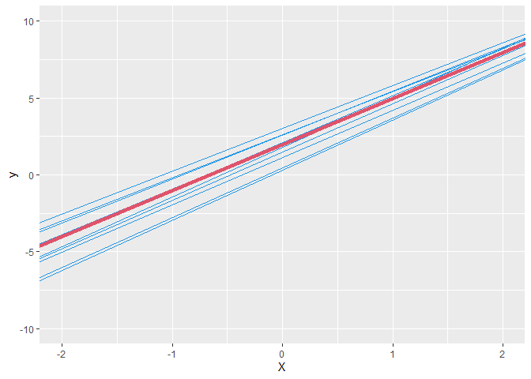
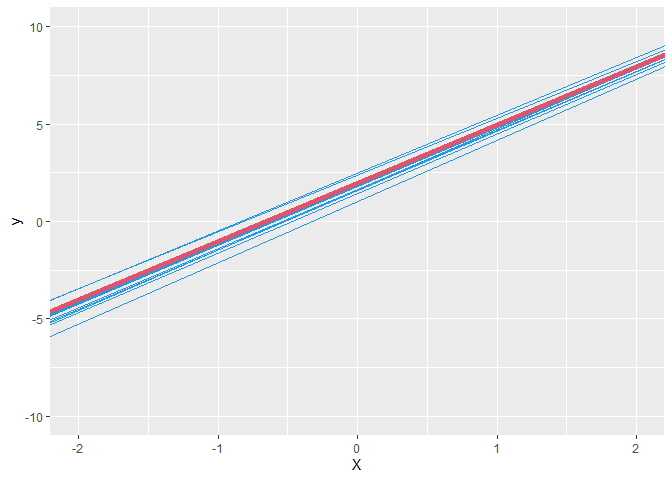
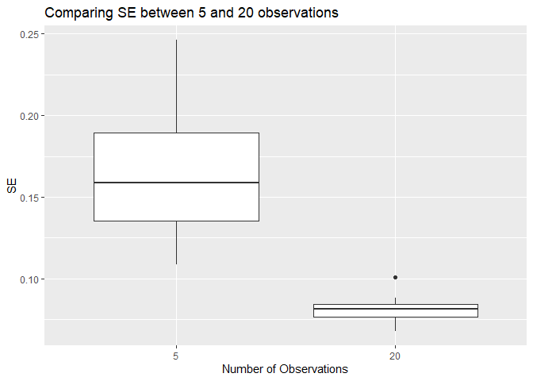
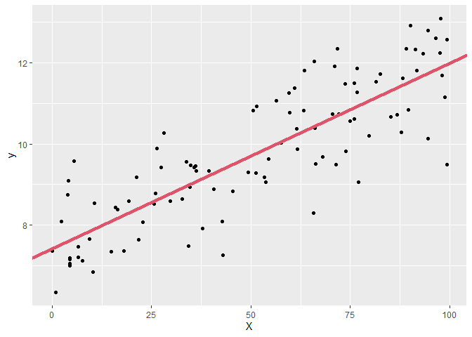
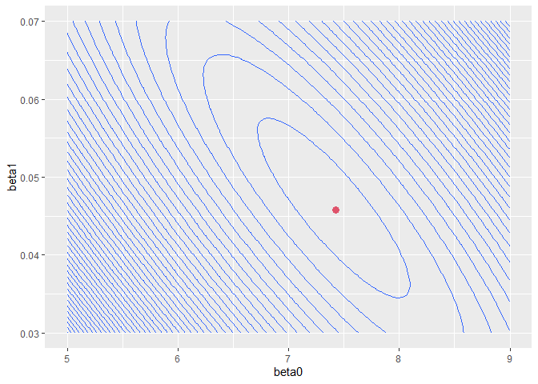
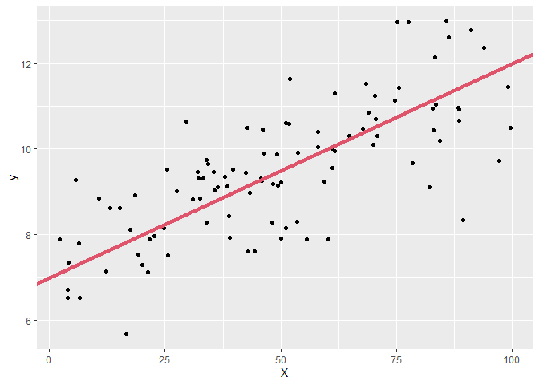
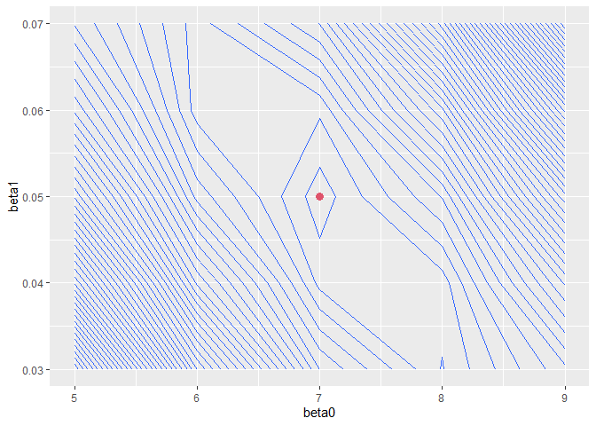

Linear Regression - Intuition
================
Pouria
1/24/2022

# Objective

The objective of this project is to practice the use of closed-from
representation of a simple univariate linear regression. We aim to
understand the underlying structure of what linear regression does under
the hood and how it does it.

To this end, we use simulated data. What that means is we start with a
given map of a set of values representing variable `X` to those
representing the variable `y`. This way, we already know what the
parameters of the map between `X` and `y` should be. From there, we
simulate the data based off of the map equation and try to recover the
true given equation using linear regression.

# Part 1: Closed-Form Representation

In this first exercise, we will simulate different datasets with the
following given map.

$$y = 2 + 3 X + \epsilon,$$

with $X$ randomly generated via a uniform distribution from 0 to 10, and
$\epsilon$ generated via a normal (Gaussian) distribution of 0 mean and
variance 1 (which we note, $\epsilon \sim N(\mu, \sigma^2)$, where
$\mu=0$ and $\sigma=1$). Our goals and questions to address in this part
are as follows:

1.  Generate 10 “experiments” with 5 observations each. Compute the
    slopes and the intercepts using the closed-form equations shown
    below, check that the values are the same as given by the `lm()`
    function in R , and plot the 10 different lines. Also plot in bold
    the “true” line.

$$\hat{\beta}_1 = \frac{\sum_{i=1}^{n}(x_i-\bar{x})(y_i-\bar{y})}{\sum_{i=1}^{n}(x_i-\bar{x})^2 },$$
$$\hat{\beta}_0 = \bar{y} - \hat{\beta}_1\bar{x}$$

2.  Repeat 10 experiments, but with 20 observations each. Plot the 10
    different lines. What do you conclude?

3.  For each 5 and 20 observations, use the formulas below to compute
    the SE for the slope.

- Plot the SEs in both conditions.
- Is this this difference statistically significant?
- Why is the SE smaller for 20 observations?

Equations for computing SE:

$$SE(\hat{\beta_0})^2 = \sigma^2[\frac{1}{n} + \frac{\bar{x}^2}{\sum_{i=1}^{n}(x_i-\bar{x})^2 }],$$
$$SE(\hat{\beta_1})^2 = \frac{\sigma^2}{\sum_{i=1}^{n}(x_i-\bar{x})^2 }$$

## Functions

The following is the closed-form univariate regression formula

``` r
Eq3.4 <- function(X, y){
  
  # Equations to estimate beta0 and beta1
  beta1 = sum((X-mean(X))*(y-mean(y))) / sum((X-mean(X))^2)
  beta0 = mean(y) - beta1*mean(X)
  
  return(list(beta0, beta1))
}
```

In the following, I will code up the function for finding the fits and
stacking them in a structure for any given number of observations and
experiments:

``` r
Experiment <- function(N.Obs, N.Exp, X.min, X.max, epsilon.mu, epsilon.sd){
  
  beta0 <- beta1 <- 0
  beta0_lm <- beta1_lm <- 0
  SE_beta1 <- 0
  
  for (i in 1:N.Exp){
    X = runif(N.Obs, min = X.min, max = X.max)
    epsilon = rnorm(N.Obs, mean = epsilon.mu, sd = epsilon.sd)
    y = 2 + 3*X + epsilon
    
#    n.exp = i*rep(N.Obs, 1)
    
#    data.points <- rbind(data.points, data.frame(n.exp, X, y))
    
    coeff <- Eq3.4(X, y)
    beta0[i] <- coeff[[1]]
    beta1[i] <- coeff[[2]]
    
    SE_beta1[i] <- sqrt(epsilon.sd^2 / sum((X-mean(X))^2) )
    
    fit.lm <- lm(y~X)
    beta0_lm[i] <- fit.lm$coefficients[1]
    beta1_lm[i] <- fit.lm$coefficients[2]
  }
  

  return(data.frame(beta0, beta1,beta0_lm, beta1_lm, SE_beta1))
}
```

The following function uses `ggplot` functionality to visualize the
results of the linear regression.

``` r
Visualize <- function(Coeff.df){
  # data.points = data.frame(X, y)
  ggplot() +
    geom_abline(data = Coeff.df, aes(slope=beta1 , intercept=beta0), col=4) +
    geom_abline(aes(slope = 3, intercept = 2), size=1.5, col=2) +
    scale_x_continuous(name="X", limits=c(-2,2)) +
    scale_y_continuous(name="y", limits=c(-10,10))
    # geom_point(data.points, aes(X,y, col = n.exp))
    
}
```

## Part 1.a

Set up the parameters

``` r
N.Exp = 10
N.Obs = 5
X.min = 0
X.max = 10
epsilon.mu = 0
epsilon.sd = 1
```

Coefficients for 5 observations from 10 experiments

``` r
Coeff.df <- Experiment(N.Obs, N.Exp, X.min, X.max, epsilon.mu, epsilon.sd)

Coeff.df
```

    ##        beta0    beta1  beta0_lm beta1_lm  SE_beta1
    ## 1  1.8325347 3.234249 1.8325347 3.234249 0.1722568
    ## 2  0.4773691 3.241904 0.4773691 3.241904 0.2326905
    ## 3  3.0363808 2.791298 3.0363808 2.791298 0.5751827
    ## 4  2.6413420 2.810049 2.6413420 2.810049 0.1929529
    ## 5  2.0723671 2.972851 2.0723671 2.972851 0.1987511
    ## 6  1.5096025 3.151717 1.5096025 3.151717 0.1957845
    ## 7  1.1586475 3.077805 1.1586475 3.077805 0.2630907
    ## 8  2.6128772 2.864282 2.6128772 2.864282 0.1723915
    ## 9  2.1375712 3.057920 2.1375712 3.057920 0.2191927
    ## 10 0.3265521 3.265246 0.3265521 3.265246 0.1665418

Visualize for 5 observations from 10 experiments

``` r
Visualize(Coeff.df)
```

<!-- -->

## Part 1.b

Set up the parameters according to 1.b. Now doing this is associated
with increasing the number of observations. Let’s see the results on a
graph.

``` r
N.Exp = 10
N.Obs = 20
X.min = 0
X.max = 10
epsilon.mu = 0
epsilon.sd = 1
```

Coefficients for 20 observations from 10 experiments;

``` r
Coeff.df <- Experiment(N.Obs, N.Exp, X.min, X.max, epsilon.mu, epsilon.sd)
Coeff.df
```

    ##       beta0    beta1 beta0_lm beta1_lm   SE_beta1
    ## 1  1.871731 2.999862 1.871731 2.999862 0.07773010
    ## 2  2.415609 2.921739 2.415609 2.921739 0.08307054
    ## 3  1.053430 3.150412 1.053430 3.150412 0.08709019
    ## 4  1.842016 3.016367 1.842016 3.016367 0.08099962
    ## 5  1.601847 3.054771 1.601847 3.054771 0.07326359
    ## 6  1.809730 3.024083 1.809730 3.024083 0.06254796
    ## 7  1.666287 3.113299 1.666287 3.113299 0.08071859
    ## 8  1.683003 3.040530 1.683003 3.040530 0.07904811
    ## 9  1.448570 3.061155 1.448570 3.061155 0.07209116
    ## 10 2.495821 2.973622 2.495821 2.973622 0.07094516

Now let’s visualize for 20 observations from 10 experiments

``` r
Visualize(Coeff.df)
```

<!-- -->

As can be seen in the two last figures, the linear fit (red lines)
estimated from data with 20 observations lies within a less variable
range than the linear fit from 5 observations does. In other words, the
confidence interval in 20 observations is thinner, and the estimate of
the fit is generally closer to the true given fit.

## Part 1.c

No, for each of the cases with 5 and 20 observations, we use the formula
below to compute the SE for the slope.

$$SE(\hat{\beta_0})^2 = \sigma^2[\frac{1}{n} + \frac{\bar{x}^2}{\sum_{i=1}^{n}(x_i-\bar{x})^2 }],$$
$$SE(\hat{\beta_1})^2 = \frac{\sigma^2}{\sum_{i=1}^{n}(x_i-\bar{x})^2 }$$

Let’s plot the SEs from both conditions.

``` r
ggplot(SE.df, aes(x = N.Obs, y = SE)) +
geom_boxplot() +
scale_x_discrete(limits = rev) +
labs(
title = "Comparing SE between 5 and 20 observations",
x = 'Number of Observations',
y = 'SE'
)
```

<!-- -->

Let’s see if this difference is statistically significant:

``` r
t.test(SE.5, SE.20, alternative = "two.sided", var.equal = F)
```

    ## 
    ##  Welch Two Sample t-test
    ## 
    ## data:  SE.5 and SE.20
    ## t = 6.1469, df = 9.8259, p-value = 0.0001172
    ## alternative hypothesis: true difference in means is not equal to 0
    ## 95 percent confidence interval:
    ##  0.05384703 0.11531067
    ## sample estimates:
    ##  mean of x  mean of y 
    ## 0.16628971 0.08171086

We can see that the SE computed for 20 observations is significantly
smaller than the case with 5 observations.

You may ask why. Well, intuitively, more observations will add more
reliability to your estimation of the fit parameters. The more
observations you have, the more confident you can be in your obtained
fit, and the smaller you standard error (SE) would be. Moreover,
technically, looking closely at the SE equations above, you can see that
the number of terms in the SE equation denominator is proportionate with
the number of observations.

# Part 2: Iterative Search

Now we will try to estimate coefficients of a linear regression model
via systematic simulations

1.  We will now use the following model

$$y = 7 + 0.05 *X + \epsilon,$$

with $\epsilon \sim \mathcal{N}(0, 1)$

2.  We will then plot the regression line with 100 observations

3.  Now using 2 for-loops over the parameters with about 100 steps for
    each parameter, we will generate a contour plot of the cost as a
    function the intercept and slope parameters.

4.  We will then Find the minimum of RSS curve using `min()`? Plot the
    minimum on the figure. How does this compare with the parameters
    given by the `lm()`.

5.  Next, we will repeat with about 5 steps for each parameter, and
    Generate the figure again. How does this compare with the parameters
    given by the `lm()`? What do you conclude?

6.  *Bonus*: generate 3D plots like figure 3.2B

## Part 2.a

``` r
RSS_func <- function(b0, b1, X, y){
  y_hat = b0 + b1*X
  RSS = sum( ( y-y_hat )^2 )
  
  return(RSS)
}
```

``` r
i <- 0

N.Obs = 100
X = runif(N.Obs, min = 0, max = 100)
epsilon = rnorm(N.Obs, mean = 0, sd = 1)
#y = 2 + 3*X + epsilon
y = 7.0 + .05*X + epsilon

beta1 <- beta0 <- 0
RSS <- 0

for (bet0 in seq(5,9,length.out=100)){
  for (bet1 in seq(.03,.07,length.out=100)){
    i <- i+1
    beta0[i] <- bet0
    beta1[i] <- bet1
    RSS[i]   <- RSS_func(bet0, bet1, X, y)
  }
}

beta0.opt <- beta0[RSS==min(RSS)]
beta1.opt <- beta1[RSS==min(RSS)]
```

## Part 2.b

``` r
datapoints = data.frame(X,y)
ggplot(datapoints, aes(X, y))+
  geom_point() +
  geom_abline(aes(slope = beta1.opt, intercept=beta0.opt), color = 2, size = 1.5)
```

<!-- -->

## Part 2.c

``` r
df.RSS = data.frame(beta0, beta1, RSS)
var.opt = data.frame(beta0.opt, beta1.opt)

ggplot(df.RSS, aes(beta0, beta1, z=RSS)) +
  geom_contour(bins = 50) +
  geom_point(aes(x = beta0.opt, y = beta1.opt), color=2, size=3)
```

<!-- -->

## Part 2.d

``` r
fit = lm(y~X)

beta0.lm = fit$coefficients[1]
beta1.lm = fit$coefficients[2]

data.frame(beta0.opt, beta1.opt, beta0.lm, beta1.lm)
```

    ##             beta0.opt  beta1.opt beta0.lm   beta1.lm
    ## (Intercept)  7.424242 0.04575758 7.408083 0.04603391

``` r
i <- 0

N.Obs = 100
X = runif(N.Obs, min = 0, max = 100)
epsilon = rnorm(N.Obs, mean = 0, sd = 1)
#y = 2 + 3*X + epsilon
y = 7.0 + .05*X + epsilon

beta1 <- beta0 <- 0
RSS <- 0

for (bet0 in seq(5,9,length.out=5)){
  for (bet1 in seq(.03,.07,length.out=5)){
    i <- i+1
    beta0[i] <- bet0
    beta1[i] <- bet1
    RSS[i]   <- RSS_func(bet0, bet1, X, y)
  }
}

beta0.opt <- beta0[RSS==min(RSS)]
beta1.opt <- beta1[RSS==min(RSS)]
```

## Part 2.e:

Let’s visualize the regression

``` r
datapoints = data.frame(X,y)
ggplot(datapoints, aes(X, y))+
  geom_point() +
  geom_abline(aes(slope = beta1.opt, intercept=beta0.opt), color = 2, size = 1.5)
```

<!-- -->

Now we will take a look at the contour plot

``` r
df.RSS = data.frame(beta0, beta1, RSS)
var.opt = data.frame(beta0.opt, beta1.opt)

ggplot(df.RSS, aes(beta0, beta1, z=RSS)) +
  geom_contour(bins = 50) +
  geom_point(aes(x = beta0.opt, y = beta1.opt), color=2, size=3)
```

<!-- -->

Now, let’s compare the coefficients from the two methods

``` r
fit = lm(y~X)

beta0.lm = fit$coefficients[1]
beta1.lm = fit$coefficients[2]

data.frame(beta0.opt, beta1.opt, beta0.lm, beta1.lm)
```

    ##             beta0.opt beta1.opt beta0.lm   beta1.lm
    ## (Intercept)         7      0.05 7.316704 0.04410561

# Part 3: Gradient Descent

Now we will try to estimate the parameters via a method called “gradient
descent”. Given a random starting point, we will “descend” along the
steepest gradient in parameter space until we converge to the minimum.

$$\hat{y}=X\theta$$ $$L=\frac{1}{2m}\sum_{i=1}^{m}(y_i-\hat{y}_i)^2$$
$$L=\frac{1}{2m}(\mathbf{y}-X\theta)^T(\mathbf{y}-X\theta)$$

$$...$$
