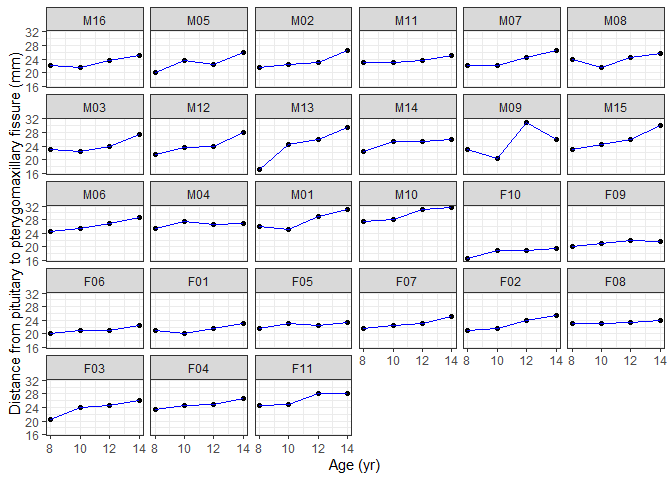
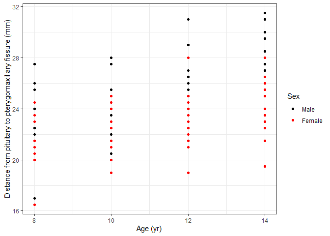
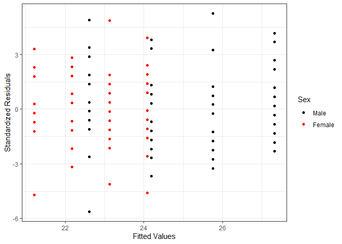
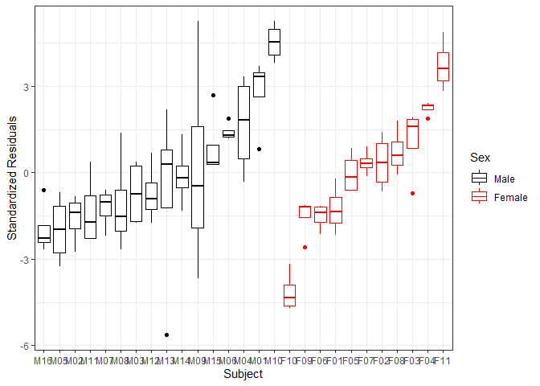
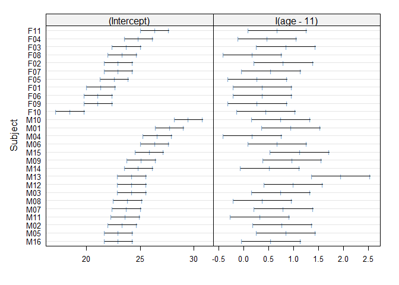
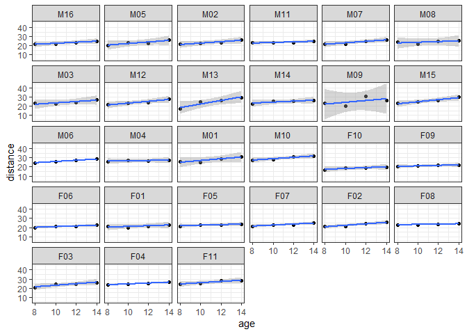
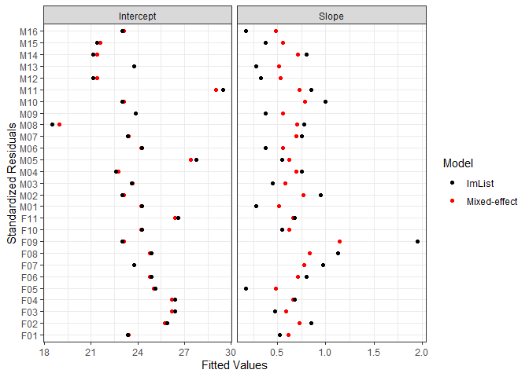
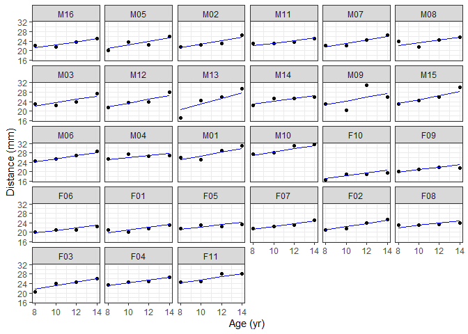
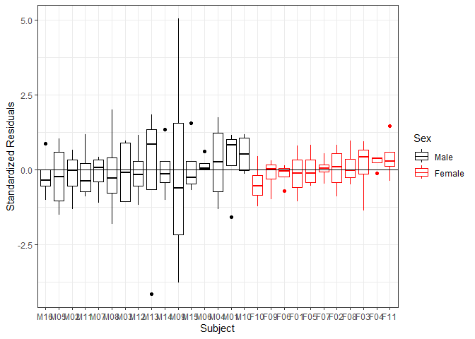
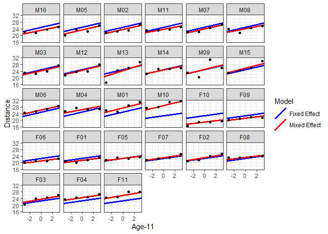

Linear Mixed Effect Model for Orthodontic Growth Data
================
Pouria
28 February, 2022

## Objective

In this project, the objective is to infer an ML model that can fit to
the longitudinal Orthodontic Growth dataset. The independent variables
of interest in this set are `age`, `gender`, and `sex`. In this project,
we seek to find the most important factors among these and also see if
we need a model beyond linear regression to explain the data.

## Required Libraries

``` r
library(nlme)
library(ggplot2)
library(dplyr)
library(tidyr)
library(magrittr)
```

## Into to “Orthodontic growth” dataset

**Orthodontic growth data, Example from Pinheiro and Bates (2000)**

Investigators at the University of North Carolina Dental School followed
the growth of 27 children(16 males, 11 females) from age 8 until age 14.
Every two years they measured the distance between the pituitary and the
pterygomaxillary fissure, two points that are easily identified on xray
exposures of the side of the head.

``` r
attach(Orthodont)
head(Orthodont)
```

    ## Grouped Data: distance ~ age | Subject
    ##   distance age Subject  Sex
    ## 1     26.0   8     M01 Male
    ## 2     25.0  10     M01 Male
    ## 3     29.0  12     M01 Male
    ## 4     31.0  14     M01 Male
    ## 5     21.5   8     M02 Male
    ## 6     22.5  10     M02 Male

## Questions

- Is there an `age` effect on growth?

- Is there a `gender` difference?

- Is `growth` different in sexes (Is there an interaction)?

- Is an ordinary linear regression model adequate? If not, what is the
  best way we can build an interpretable model that explains this data?

## Preliminary Visualization

Let’s plot the data per subject

``` r
ggplot(Orthodont) +
  geom_point(aes(x = age, y = distance)) +
  geom_line(aes(x = age, y = distance), color="blue") +
  facet_wrap (~Subject) +
  xlab("Age (yr)") + 
  ylab("Distance from pituitary to pterygomaxillary fissure (mm)") +
  theme_bw()
```

<!-- -->

Now plot the data in a scatter-plot

``` r
ggplot(Orthodont) +
  geom_point(aes(x = age, y = distance, col = Sex)) +
  xlab("Age (yr)") + 
  ylab("Distance from pituitary to pterygomaxillary fissure (mm)") +
  scale_color_manual(values=c("black", "red")) +
  theme_bw()
```

<!-- -->

## Data Modeling Part 1: Simple Linear Regression to fit all

#### Does one model fit all?

Let’s see. In order to do this, the assumption is that there is no
significant effect of `Subject`. Thus, we will have:

$$y_j^{(i)} = \beta_0 + \beta_1 * age_j^{(i)} + \epsilon_j^{(i)}$$ where

Subject_ID: $i=1,..., M \qquad (M=27)$

Year_ID: $j=1,..., N \qquad (N=4)$

residuals: $\epsilon_j^{(i)} = \cal N(0,\sigma^2)$

Let’s code the one-fits-all linear regression up:

``` r
lm.fit_all <- lm(distance ~ I(age-11)*Sex, Orthodont)
summary(lm.fit_all)
```

    ## 
    ## Call:
    ## lm(formula = distance ~ I(age - 11) * Sex, data = Orthodont)
    ## 
    ## Residuals:
    ##     Min      1Q  Median      3Q     Max 
    ## -5.6156 -1.3219 -0.1682  1.3299  5.2469 
    ## 
    ## Coefficients:
    ##                       Estimate Std. Error t value Pr(>|t|)    
    ## (Intercept)            24.9687     0.2821  88.504  < 2e-16 ***
    ## I(age - 11)             0.7844     0.1262   6.217 1.07e-08 ***
    ## SexFemale              -2.3210     0.4420  -5.251 8.05e-07 ***
    ## I(age - 11):SexFemale  -0.3048     0.1977  -1.542    0.126    
    ## ---
    ## Signif. codes:  0 '***' 0.001 '**' 0.01 '*' 0.05 '.' 0.1 ' ' 1
    ## 
    ## Residual standard error: 2.257 on 104 degrees of freedom
    ## Multiple R-squared:  0.4227, Adjusted R-squared:  0.4061 
    ## F-statistic: 25.39 on 3 and 104 DF,  p-value: 2.108e-12

Below, we will take a look at the residuals of the mode.

``` r
ggplot(lm.fit_all) +
  geom_point(aes(x = .fitted, y = .resid, col = Sex)) +
  scale_color_manual(values=c("black", "red")) +
  xlab("Fitted Values") + ylab("Standardized Residuals") +
  theme_bw()
```

<!-- -->

At first glance, the residuals seem to be homoscedastic. However, we
cannot really tell much from this plot. Importantly, if the effect of
`Subject` is non-existent, then the residuals across different subjects
should not differ. Let’s see if that is the case:

### Residuals for each subject

``` r
ggplot(lm.fit_all) +
  geom_boxplot(aes(x = Subject, y = .resid, col = Sex)) +
  scale_color_manual(values=c("black", "red")) +
  xlab("Subject") + ylab("Standardized Residuals") +
  theme_bw()
```

<!-- -->

Looks like the one-fits-all model did not do a good job fitting onto
everyone’s data. This means the effect of `Subject` should be considered
in our modeling process. But how?

Well, one way to do this is fit an independent model per subject. We
will do that in the following:

## Data Modeling Part 2: Simple Linear Regression Per Subject

### Fit the model:

Use `lmList(.)`

\*\* `age` as the only covariate \*\*

``` r
lm.fit_perSubj <- lmList(distance ~ I(age-11) | Subject, Orthodont)

summary(lm.fit_perSubj)
```

    ## Call:
    ##   Model: distance ~ I(age - 11) | Subject 
    ##    Data: Orthodont 
    ## 
    ## Coefficients:
    ##    (Intercept) 
    ##     Estimate Std. Error  t value     Pr(>|t|)
    ## M16   23.000  0.6550198 35.11344 7.229908e-39
    ## M05   23.000  0.6550198 35.11344 7.229908e-39
    ## M02   23.375  0.6550198 35.68594 3.127804e-39
    ## M11   23.625  0.6550198 36.06761 1.801423e-39
    ## M07   23.750  0.6550198 36.25845 1.369868e-39
    ## M08   23.875  0.6550198 36.44928 1.043080e-39
    ## M03   24.250  0.6550198 37.02178 4.641294e-40
    ## M12   24.250  0.6550198 37.02178 4.641294e-40
    ## M13   24.250  0.6550198 37.02178 4.641294e-40
    ## M14   24.875  0.6550198 37.97595 1.234662e-40
    ## M09   25.125  0.6550198 38.35762 7.332650e-41
    ## M15   25.875  0.6550198 39.50262 1.580399e-41
    ## M06   26.375  0.6550198 40.26596 5.812844e-42
    ## M04   26.625  0.6550198 40.64763 3.548813e-42
    ## M01   27.750  0.6550198 42.36513 4.059867e-43
    ## M10   29.500  0.6550198 45.03681 1.633487e-44
    ## F10   18.500  0.6550198 28.24342 5.063500e-34
    ## F09   21.125  0.6550198 32.25093 5.809918e-37
    ## F06   21.125  0.6550198 32.25093 5.809918e-37
    ## F01   21.375  0.6550198 32.63260 3.173132e-37
    ## F05   22.625  0.6550198 34.54094 1.692434e-38
    ## F07   23.000  0.6550198 35.11344 7.229908e-39
    ## F02   23.000  0.6550198 35.11344 7.229908e-39
    ## F08   23.375  0.6550198 35.68594 3.127804e-39
    ## F03   23.750  0.6550198 36.25845 1.369868e-39
    ## F04   24.875  0.6550198 37.97595 1.234662e-40
    ## F11   26.375  0.6550198 40.26596 5.812844e-42
    ##    I(age - 11) 
    ##     Estimate Std. Error   t value     Pr(>|t|)
    ## M16    0.550  0.2929338 1.8775576 6.584707e-02
    ## M05    0.850  0.2929338 2.9016799 5.361639e-03
    ## M02    0.775  0.2929338 2.6456493 1.065760e-02
    ## M11    0.325  0.2929338 1.1094659 2.721458e-01
    ## M07    0.800  0.2929338 2.7309929 8.511442e-03
    ## M08    0.375  0.2929338 1.2801529 2.059634e-01
    ## M03    0.750  0.2929338 2.5603058 1.328807e-02
    ## M12    1.000  0.2929338 3.4137411 1.222240e-03
    ## M13    1.950  0.2929338 6.6567951 1.485652e-08
    ## M14    0.525  0.2929338 1.7922141 7.870160e-02
    ## M09    0.975  0.2929338 3.3283976 1.577941e-03
    ## M15    1.125  0.2929338 3.8404587 3.247135e-04
    ## M06    0.675  0.2929338 2.3042752 2.508117e-02
    ## M04    0.175  0.2929338 0.5974047 5.527342e-01
    ## M01    0.950  0.2929338 3.2430540 2.030113e-03
    ## M10    0.750  0.2929338 2.5603058 1.328807e-02
    ## F10    0.450  0.2929338 1.5361835 1.303325e-01
    ## F09    0.275  0.2929338 0.9387788 3.520246e-01
    ## F06    0.375  0.2929338 1.2801529 2.059634e-01
    ## F01    0.375  0.2929338 1.2801529 2.059634e-01
    ## F05    0.275  0.2929338 0.9387788 3.520246e-01
    ## F07    0.550  0.2929338 1.8775576 6.584707e-02
    ## F02    0.800  0.2929338 2.7309929 8.511442e-03
    ## F08    0.175  0.2929338 0.5974047 5.527342e-01
    ## F03    0.850  0.2929338 2.9016799 5.361639e-03
    ## F04    0.475  0.2929338 1.6215270 1.107298e-01
    ## F11    0.675  0.2929338 2.3042752 2.508117e-02
    ## 
    ## Residual standard error: 1.31004 on 54 degrees of freedom

### Plot 95% confidence intervals

intercept and slope for each subject

``` r
coef.95.perSubj <- intervals(lm.fit_perSubj)
plot(coef.95.perSubj)
```

<!-- -->

### Plot fits for each subject

``` r
ggplot(Orthodont, aes(x = age, y = distance)) + 
  geom_point() +
  geom_smooth(method="lm") +
  facet_wrap(~Subject) +
  theme_bw()
```

    ## `geom_smooth()` using formula = 'y ~ x'

<!-- -->

### Comments

- Residuals corresponding to the same subject tend to have the same
  sign.

- There is a significant subject-to-subject variability for intercept.

- Need to incorporate a “subject effect” in the model to account for
  between-subject variability.

### What if we use `Subject` as an actual effect?

- Inference about subject effect will not be applicable to the whole
  population

- You would still need M-1 dummy variables

#### e.g. use dummy variables for `Subject` effect

``` r
lm.fit_SubjVariable <- lm(distance ~ I(age-11)*Subject, data = Orthodont)
summary(lm.fit_SubjVariable)
```

    ## 
    ## Call:
    ## lm(formula = distance ~ I(age - 11) * Subject, data = Orthodont)
    ## 
    ## Residuals:
    ##     Min      1Q  Median      3Q     Max 
    ## -3.6500 -0.4500  0.0500  0.4125  4.9000 
    ## 
    ## Coefficients:
    ##                        Estimate Std. Error t value Pr(>|t|)    
    ## (Intercept)            24.02315    0.12606 190.571  < 2e-16 ***
    ## I(age - 11)             0.66019    0.05638  11.711  < 2e-16 ***
    ## Subject.L              -0.40151    0.65502  -0.613 0.542467    
    ## Subject.Q              -1.58035    0.65502  -2.413 0.019261 *  
    ## Subject.C               5.07921    0.65502   7.754 2.46e-10 ***
    ## Subject^4               4.48880    0.65502   6.853 7.14e-09 ***
    ## Subject^5              -1.20233    0.65502  -1.836 0.071932 .  
    ## Subject^6              -3.23605    0.65502  -4.940 7.91e-06 ***
    ## Subject^7               0.70438    0.65502   1.075 0.286999    
    ## Subject^8               3.61632    0.65502   5.521 9.87e-07 ***
    ## Subject^9               0.59672    0.65502   0.911 0.366343    
    ## Subject^10             -2.68626    0.65502  -4.101 0.000139 ***
    ## Subject^11             -1.76453    0.65502  -2.694 0.009391 ** 
    ## Subject^12              1.50490    0.65502   2.297 0.025493 *  
    ## Subject^13              1.91246    0.65502   2.920 0.005102 ** 
    ## Subject^14             -0.40136    0.65502  -0.613 0.542614    
    ## Subject^15             -1.97404    0.65502  -3.014 0.003925 ** 
    ## Subject^16             -0.49115    0.65502  -0.750 0.456618    
    ## Subject^17              1.81633    0.65502   2.773 0.007609 ** 
    ## Subject^18              0.97600    0.65502   1.490 0.142036    
    ## Subject^19             -1.59870    0.65502  -2.441 0.017970 *  
    ## Subject^20             -1.86073    0.65502  -2.841 0.006336 ** 
    ## Subject^21              0.43380    0.65502   0.662 0.510613    
    ## Subject^22              2.58290    0.65502   3.943 0.000233 ***
    ## Subject^23              1.30736    0.65502   1.996 0.050998 .  
    ## Subject^24              1.89195    0.65502   2.888 0.005561 ** 
    ## Subject^25             -2.44371    0.65502  -3.731 0.000460 ***
    ## Subject^26             -2.49000    0.65502  -3.801 0.000368 ***
    ## I(age - 11):Subject.L  -0.49787    0.29293  -1.700 0.094959 .  
    ## I(age - 11):Subject.Q  -0.19737    0.29293  -0.674 0.503339    
    ## I(age - 11):Subject.C   0.69724    0.29293   2.380 0.020864 *  
    ## I(age - 11):Subject^4   0.18177    0.29293   0.621 0.537521    
    ## I(age - 11):Subject^5  -0.52930    0.29293  -1.807 0.076351 .  
    ## I(age - 11):Subject^6   0.04439    0.29293   0.152 0.880128    
    ## I(age - 11):Subject^7   0.31577    0.29293   1.078 0.285845    
    ## I(age - 11):Subject^8  -0.35425    0.29293  -1.209 0.231814    
    ## I(age - 11):Subject^9   0.39717    0.29293   1.356 0.180791    
    ## I(age - 11):Subject^10  0.07296    0.29293   0.249 0.804247    
    ## I(age - 11):Subject^11 -0.30961    0.29293  -1.057 0.295250    
    ## I(age - 11):Subject^12  0.03733    0.29293   0.127 0.899057    
    ## I(age - 11):Subject^13  0.32029    0.29293   1.093 0.279072    
    ## I(age - 11):Subject^14  0.11895    0.29293   0.406 0.686297    
    ## I(age - 11):Subject^15  0.22165    0.29293   0.757 0.452547    
    ## I(age - 11):Subject^16  0.35132    0.29293   1.199 0.235645    
    ## I(age - 11):Subject^17 -0.08249    0.29293  -0.282 0.779317    
    ## I(age - 11):Subject^18  0.81596    0.29293   2.785 0.007357 ** 
    ## I(age - 11):Subject^19 -0.03182    0.29293  -0.109 0.913914    
    ## I(age - 11):Subject^20 -0.47150    0.29293  -1.610 0.113318    
    ## I(age - 11):Subject^21  0.16480    0.29293   0.563 0.576049    
    ## I(age - 11):Subject^22  0.46145    0.29293   1.575 0.121033    
    ## I(age - 11):Subject^23 -0.58904    0.29293  -2.011 0.049346 *  
    ## I(age - 11):Subject^24 -0.10247    0.29293  -0.350 0.727849    
    ## I(age - 11):Subject^25 -0.21890    0.29293  -0.747 0.458143    
    ## I(age - 11):Subject^26  0.39963    0.29293   1.364 0.178153    
    ## ---
    ## Signif. codes:  0 '***' 0.001 '**' 0.01 '*' 0.05 '.' 0.1 ' ' 1
    ## 
    ## Residual standard error: 1.31 on 54 degrees of freedom
    ## Multiple R-squared:  0.899,  Adjusted R-squared:  0.7999 
    ## F-statistic:  9.07 on 53 and 54 DF,  p-value: 6.568e-14

The most important conclusion of this section is that how can you
achieve any interpretable insights about the data or even the effect of
`Subject` variable if you fit one independent regression model for each
subject.

The solution to this has been proposed by the Statisticians and
Scientists:

**Linear Mixed Effect Model**

## Data Modeling Part 3: Fit a Linear Mixed Effect Model (LME)

$$y_j^{(i)} = \quad \\
\beta_0 + \beta_1 * age_j^{(i)} + \qquad \\
                  b_0^{(i)} + b_1^{(i)} * age_j^{(i)} + \quad \epsilon_j^{(i)}$$

where

$$\begin{bmatrix}
b_0^{(i)}\\ b_1^{(i)}
\end{bmatrix} = \cal N(\mathbf{0}, \mathbf{\Psi}),\quad  \mathbf{\Psi} = \begin{bmatrix}
\sigma_0^2 & \rho\sigma_0\sigma_1\\ \rho\sigma_0\sigma_1 & \sigma_1^2
\end{bmatrix}$$

Subject_ID: $i=1,..., M \qquad (M=27)$

Year_ID: $j=1,..., N \qquad (N=4)$

residuals: $\epsilon_j^{(i)} = \cal N(0,\sigma^2)$

random effects: $b_0^{(i)}$ and $b_1^{(i)}$

What a linear mixed effect model does is that in this case, it takes
into accounts the effect of `Subject` but does not fit independent
models for each subject. Instead, it allows for a between-subject
variability through a Gaussian process. As a result, the outcome model
instead of having `M-1` levels of parameters to represent `M` subjects,
has at most 3 parameters; the diagonal and off-diagonal noise/variance
values in the covariance matrix.

### Fit a single-level mixed effect model

Both intercept and slope

``` r
lm.fit_mixed_all <- lme(distance~I(age-11), data=Orthodont, random=~I(age-11)|Subject)

summary(lm.fit_mixed_all)
```

    ## Linear mixed-effects model fit by REML
    ##   Data: Orthodont 
    ##        AIC      BIC    logLik
    ##   454.6367 470.6173 -221.3183
    ## 
    ## Random effects:
    ##  Formula: ~I(age - 11) | Subject
    ##  Structure: General positive-definite, Log-Cholesky parametrization
    ##             StdDev    Corr  
    ## (Intercept) 2.1343289 (Intr)
    ## I(age - 11) 0.2264278 0.503 
    ## Residual    1.3100402       
    ## 
    ## Fixed effects:  distance ~ I(age - 11) 
    ##                 Value Std.Error DF  t-value p-value
    ## (Intercept) 24.023148 0.4296601 80 55.91198       0
    ## I(age - 11)  0.660185 0.0712533 80  9.26533       0
    ##  Correlation: 
    ##             (Intr)
    ## I(age - 11) 0.294 
    ## 
    ## Standardized Within-Group Residuals:
    ##          Min           Q1          Med           Q3          Max 
    ## -3.223106868 -0.493760901  0.007316482  0.472151218  3.916031759 
    ## 
    ## Number of Observations: 108
    ## Number of Groups: 27

### Confidence interval of the fit

``` r
intervals(lm.fit_mixed_all)
```

    ## Approximate 95% confidence intervals
    ## 
    ##  Fixed effects:
    ##                  lower       est.      upper
    ## (Intercept) 23.1680973 24.0231481 24.8781990
    ## I(age - 11)  0.5183866  0.6601852  0.8019837
    ## 
    ##  Random Effects:
    ##   Level: Subject 
    ##                                   lower      est.     upper
    ## sd((Intercept))               1.5844477 2.1343289 2.8750458
    ## sd(I(age - 11))               0.1025150 0.2264278 0.5001179
    ## cor((Intercept),I(age - 11)) -0.2665288 0.5026262 0.8806714
    ## 
    ##  Within-group standard error:
    ##    lower     est.    upper 
    ## 1.084851 1.310040 1.581973

### Mixed Effect with diagonal covariance

``` r
lm.fit_mixed_diag <- lme( distance~I(age-11), data=Orthodont, 
                         random=list( Subject = pdDiag( ~I(age-11) ) ) )
lm.fit_mixed_diag
```

    ## Linear mixed-effects model fit by REML
    ##   Data: Orthodont 
    ##   Log-restricted-likelihood: -222.4924
    ##   Fixed: distance ~ I(age - 11) 
    ## (Intercept) I(age - 11) 
    ##  24.0231481   0.6601852 
    ## 
    ## Random effects:
    ##  Formula: ~I(age - 11) | Subject
    ##  Structure: Diagonal
    ##         (Intercept) I(age - 11) Residual
    ## StdDev:    2.134328   0.2264265 1.310041
    ## 
    ## Number of Observations: 108
    ## Number of Groups: 27

### Compare general and diagonal models

``` r
anova( lm.fit_mixed_all, lm.fit_mixed_diag)
```

    ##                   Model df      AIC      BIC    logLik   Test  L.Ratio p-value
    ## lm.fit_mixed_all      1  6 454.6367 470.6173 -221.3183                        
    ## lm.fit_mixed_diag     2  5 454.9848 468.3020 -222.4924 1 vs 2 2.348112  0.1254

### Mixed Effect with only slope as random effect

``` r
lm.fit_mixed_slope <- lme( distance~I(age-11), data=Orthodont, 
                         random=~I(age-11)-1|Subject )
lm.fit_mixed_slope
```

    ## Linear mixed-effects model fit by REML
    ##   Data: Orthodont 
    ##   Log-restricted-likelihood: -254.5847
    ##   Fixed: distance ~ I(age - 11) 
    ## (Intercept) I(age - 11) 
    ##  24.0231481   0.6601852 
    ## 
    ## Random effects:
    ##  Formula: ~I(age - 11) - 1 | Subject
    ##          I(age - 11) Residual
    ## StdDev: 3.868161e-05 2.537151
    ## 
    ## Number of Observations: 108
    ## Number of Groups: 27

### Compare general and mixed-effects-only-slope models

``` r
anova( lm.fit_mixed_diag, lm.fit_mixed_slope)
```

    ##                    Model df      AIC      BIC    logLik   Test L.Ratio p-value
    ## lm.fit_mixed_diag      1  5 454.9848 468.3020 -222.4924                       
    ## lm.fit_mixed_slope     2  4 517.1695 527.8233 -254.5848 1 vs 2 64.1847  <.0001

### Compare the coefficients between the mixed-effect and list models

``` r
df.mixed <- data.frame(coef(lm.fit_mixed_diag)) %>%
  set_colnames(c("Intercept", "Slope")) %>%
  pivot_longer(cols=1:2, names_to = "coeff_type", values_to ="coeff" )
data.coef.mixed <- data.frame(df.mixed, levels(Subject))

df.list<- data.frame(coef(lm.fit_perSubj)) %>%
  set_colnames(c("Intercept", "Slope")) %>%
  pivot_longer(cols=1:2, names_to = "coeff_type", values_to ="coeff" )
data.coef.list <- data.frame(df.list, levels(Subject))

data.coef.both <- rbind(data.coef.mixed, data.coef.list) %>%
  mutate(model = rbind(matrix(rep("Mixed-effect",54),nrow = 54) , matrix(rep("lmList",54), nrow = 54))) %>%
  set_colnames(c("coeff_type", "coeff", "Subject", "Model"))


ggplot(data.coef.both) +
  geom_point(aes(y = Subject, x = coeff, col = Model)) +
  facet_wrap(~coeff_type, scales = 'free_x') +
  scale_color_manual(values=c("black", "red")) +
  xlab("Fitted Values") + ylab("Standardized Residuals") +
  theme_bw()
```

<!-- -->

## Plot mixed effect fits for each subject

``` r
newdata <- crossing(
  Subject = Orthodont %>% pull(Subject) %>% levels() %>% factor(),
  age = c(8,10,12,14))
newdata2 <- newdata %>%
  mutate(distance = predict(lm.fit_mixed_diag, newdata))


ggplot(Orthodont, aes(x = age, y = distance)) +
  geom_point() +
  facet_wrap(~Subject) +
  geom_line(data = newdata2, color = 'blue') +
  labs(y = "Distance (mm)", x = "Age (yr)") +
  theme_bw()
```

    ## Warning: Combining variables of class <ordered> and <factor> was deprecated in ggplot2
    ## 3.4.0.
    ## ℹ Please ensure your variables are compatible before plotting (location:
    ##   `combine_vars()`)
    ## This warning is displayed once every 8 hours.
    ## Call `lifecycle::last_lifecycle_warnings()` to see where this warning was
    ## generated.

    ## Warning: Combining variables of class <ordered> and <factor> was deprecated in ggplot2
    ## 3.4.0.
    ## ℹ Please ensure your variables are compatible before plotting (location:
    ##   `join_keys()`)
    ## This warning is displayed once every 8 hours.
    ## Call `lifecycle::last_lifecycle_warnings()` to see where this warning was
    ## generated.

<!-- -->

## Consider the gender as an effect (Summarize)

``` r
lm.fit_sex_mixed_all <- lme(distance~I(age-11)*Sex, data=Orthodont, random=~I(age-11)|Subject)
summary(lm.fit_sex_mixed_all)
```

    ## Linear mixed-effects model fit by REML
    ##   Data: Orthodont 
    ##        AIC      BIC    logLik
    ##   448.5817 469.7368 -216.2908
    ## 
    ## Random effects:
    ##  Formula: ~I(age - 11) | Subject
    ##  Structure: General positive-definite, Log-Cholesky parametrization
    ##             StdDev    Corr  
    ## (Intercept) 1.8303268 (Intr)
    ## I(age - 11) 0.1803454 0.206 
    ## Residual    1.3100396       
    ## 
    ## Fixed effects:  distance ~ I(age - 11) * Sex 
    ##                           Value Std.Error DF  t-value p-value
    ## (Intercept)           24.968750 0.4860007 79 51.37595  0.0000
    ## I(age - 11)            0.784375 0.0859995 79  9.12069  0.0000
    ## SexFemale             -2.321023 0.7614168 25 -3.04829  0.0054
    ## I(age - 11):SexFemale -0.304830 0.1347353 79 -2.26243  0.0264
    ##  Correlation: 
    ##                       (Intr) I(g-11) SexFml
    ## I(age - 11)            0.102               
    ## SexFemale             -0.638 -0.065        
    ## I(age - 11):SexFemale -0.065 -0.638   0.102
    ## 
    ## Standardized Within-Group Residuals:
    ##          Min           Q1          Med           Q3          Max 
    ## -3.168078276 -0.385939095  0.007103936  0.445154622  3.849463361 
    ## 
    ## Number of Observations: 108
    ## Number of Groups: 27

## Consider the gender as an effect (Check Intervals)

``` r
intervals(lm.fit_sex_mixed_all)
```

    ## Approximate 95% confidence intervals
    ## 
    ##  Fixed effects:
    ##                            lower       est.       upper
    ## (Intercept)           24.0013898 24.9687500 25.93611023
    ## I(age - 11)            0.6131973  0.7843750  0.95555275
    ## SexFemale             -3.8891900 -2.3210227 -0.75285549
    ## I(age - 11):SexFemale -0.5730135 -0.3048295 -0.03664556
    ## 
    ##  Random Effects:
    ##   Level: Subject 
    ##                                    lower      est.     upper
    ## sd((Intercept))               1.33762546 1.8303268 2.5045099
    ## sd(I(age - 11))               0.05857957 0.1803454 0.5552186
    ## cor((Intercept),I(age - 11)) -0.54999999 0.2064345 0.7768076
    ## 
    ##  Within-group standard error:
    ##    lower     est.    upper 
    ## 1.084789 1.310040 1.582062

## Residual Plot vs. fitted value

``` r
Data_mixedeffect <- Orthodont %>%
  mutate(fit = fitted(lm.fit_sex_mixed_all),
       resid = residuals(lm.fit_sex_mixed_all))

ggplot(Data_mixedeffect) +
  geom_point(aes(x = fit, y = resid, col = Sex)) +
  scale_color_manual(values=c("black", "red")) +
  xlab("Fitted Values") + ylab("Standardized Residuals") +
  theme_bw()
```

<!-- -->

## Residuals for each subject (boxplot)

``` r
ggplot(Data_mixedeffect) +
  geom_boxplot(aes(x = Subject, y = resid, col = Sex)) +
  scale_color_manual(values=c("black", "red")) +
  geom_hline(aes(yintercept = 0)) +
  xlab("Subject") + ylab("Standardized Residuals") +
  theme_bw()
```

<!-- -->

## Compare mixed effect model and fixed effect model

``` r
anova(lm.fit_sex_mixed_all, lm.fit_all)
```

    ##                      Model df      AIC      BIC    logLik   Test  L.Ratio
    ## lm.fit_sex_mixed_all     1  8 448.5817 469.7368 -216.2908                
    ## lm.fit_all               2  5 493.5591 506.7811 -241.7796 1 vs 2 50.97746
    ##                      p-value
    ## lm.fit_sex_mixed_all        
    ## lm.fit_all            <.0001

## Check the fixed-effect and random-effect coefficients

``` r
ran.eff <- random.effects(lm.fit_sex_mixed_all)
fix.eff <- fixed.effects(lm.fit_sex_mixed_all)

ran.eff
```

    ##     (Intercept)  I(age - 11)
    ## M16 -1.75837370 -0.088647073
    ## M05 -1.73855509 -0.008474087
    ## M02 -1.41153062 -0.023562681
    ## M11 -1.21993912 -0.140519058
    ## M07 -1.07789994 -0.011926946
    ## M08 -0.99531660 -0.123853792
    ## M03 -0.63856421 -0.018682906
    ## M12 -0.62204870  0.048127916
    ## M13 -0.55928976  0.302009038
    ## M14 -0.10012962 -0.070554891
    ## M09  0.15091771  0.053007690
    ## M15  0.82478527  0.103003489
    ## M06  1.23769619 -0.010649786
    ## M04  1.42598458 -0.140968327
    ## M01  2.47312004  0.081009179
    ## M10  4.00914355  0.050682235
    ## F10 -3.67384216 -0.062697289
    ## F09 -1.36154914 -0.074782293
    ## F06 -1.35494294 -0.048057965
    ## F01 -1.13362352 -0.044754863
    ## F05 -0.03363264 -0.054963682
    ## F07  0.31651355  0.023482875
    ## F02  0.33302906  0.090293697
    ## F08  0.62371941 -0.071778704
    ## F03  1.00029041  0.113565167
    ## F04  1.97145452  0.028212894
    ## F11  3.31258343  0.101480163

``` r
fix.eff
```

    ##           (Intercept)           I(age - 11)             SexFemale 
    ##            24.9687500             0.7843750            -2.3210227 
    ## I(age - 11):SexFemale 
    ##            -0.3048295

## Plot the fixed and mixed effects fits on the same graph per subject

``` r
coeffs.model.mixed <- matrix(rep(0,54), nrow = 27)
coeffs.model.fixed <- matrix(rep(0,54), nrow = 27)


coeffs.model.fixed[1:16,1] <- fix.eff[1]
coeffs.model.fixed[1:16,2] <- fix.eff[2]
coeffs.model.fixed[16:27,1] <- fix.eff[1]+ fix.eff[3]
coeffs.model.fixed[16:27,2] <- fix.eff[2]+ fix.eff[4]

coeffs.model.mixed[1:16,1] <- ran.eff[1:16,1] + fix.eff[1]
coeffs.model.mixed[1:16,2] <- ran.eff[1:16,2] + fix.eff[2]
coeffs.model.mixed[17:27,1]<- ran.eff[17:27,1] + fix.eff[1]+ fix.eff[3]
coeffs.model.mixed[17:27,2]<- ran.eff[17:27,2] + fix.eff[2]+ fix.eff[4]


ids <- Orthodont %>% pull(Subject) %>% levels() %>% factor()

# make a tibble with the data extracted above
coeffs.model.fixed <- tibble(Subject = ids,
                  intercept = coeffs.model.fixed[,1],
                  slope = coeffs.model.fixed[,2])

coeffs.model.mixed <- tibble(Subject = ids,
                  intercept = coeffs.model.mixed[,1],
                  slope = coeffs.model.mixed[,2])
```

``` r
ggplot(Orthodont, aes(x = I(age-11), y = distance)) +
  geom_abline(data = coeffs.model.fixed, aes(intercept = intercept, 
                  slope = slope, col="Fixed Effect"), size = 1.3) +
  geom_abline(data = coeffs.model.mixed, aes(intercept = intercept, 
                  slope = slope, col="Mixed Effect"), size = 1.3) +
  geom_point() +
  facet_wrap(~Subject) +
  labs(x = "Age-11", y = "Distance", color = "Model") +
  scale_color_manual(values = c("blue", "red")) +
  theme_bw()
```

    ## Warning: Using `size` aesthetic for lines was deprecated in ggplot2 3.4.0.
    ## ℹ Please use `linewidth` instead.
    ## This warning is displayed once every 8 hours.
    ## Call `lifecycle::last_lifecycle_warnings()` to see where this warning was
    ## generated.

    ## Warning: Combining variables of class <factor> and <ordered> was deprecated in ggplot2
    ## 3.4.0.
    ## ℹ Please ensure your variables are compatible before plotting (location:
    ##   `combine_vars()`)
    ## This warning is displayed once every 8 hours.
    ## Call `lifecycle::last_lifecycle_warnings()` to see where this warning was
    ## generated.

<!-- -->

# Conclusion

We saw that to infer a model that fits the data from different subjects,
we sometimes need to consider the effect of between-subject variability.
In this project, we took the opportunity to familiarize ourselves with
one of the most powerful methods that does this; linear mixed effect
model. We saw that a simple one-fits-all model did not do a great job in
explaining the data from all subjects, while a one-model-per-subject
method had too many parameters in the model to estimate compromising the
interpretability of the outcome model. The solution to the rescue was a
linear mixed effect model. After using a linear mixed effect model, we
saw that the residuals across all individuals’s data were homoscedastic
and also the model was still interpretable since the number of
parameters to find in this model was small.
