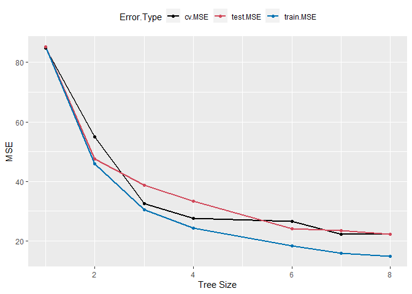

Tree-Based & Ensemble Methods
================
Pouria
4/25/2022

- [Objective](#objective)
- [Required Libraries](#required-libraries)
- [Split the data](#split-the-data)
- [Regression Trees](#regression-trees)
  - [Cross-Validation for the Tree -
    Pruning](#cross-validation-for-the-tree---pruning)
  - [Cross-Validation - Pruning](#cross-validation---pruning)
- [Bagging](#bagging)
- [Random Forest](#random-forest)
- [Conclusion](#conclusion)

# Objective

We aim to gain hands-on experience with tree-based regression and
ensemble methods on `Boston` data set to predict `medv` as a function of
all other variables.

You may access `Boston` within the library `MASS`.

# Required Libraries

``` r
# library(ISLR)
library(MASS)
library(tree)
library(randomForest)
library(magrittr)
library(ggplot2)
library(dplyr)
library(tidyr)
```

``` r
set.seed(123)
```

# Split the data

Split the into training and test sets with the train-to-test ratio of
80%/20%.

``` r
data = Boston
dim(Boston)
```

    ## [1] 506  14

``` r
train.size <- nrow(data)*0.80
train <- sample(nrow(data), train.size)

Boston.train <- data[train,]
Boston.test  <- data[-train,]
```

# Regression Trees

Let’s fit a tree onto the data

``` r
tree.Boston <- tree(medv ~ ., data = Boston.train)
summary(tree.Boston)
```

    ## 
    ## Regression tree:
    ## tree(formula = medv ~ ., data = Boston.train)
    ## Variables actually used in tree construction:
    ## [1] "rm"    "lstat" "dis"   "crim" 
    ## Number of terminal nodes:  8 
    ## Residual mean deviance:  15.15 = 5997 / 396 
    ## Distribution of residuals:
    ##     Min.  1st Qu.   Median     Mean  3rd Qu.     Max. 
    ## -23.5800  -2.3090   0.1121   0.0000   2.2110  15.9300

The tree looks like the following:

``` r
plot(tree.Boston)
text(tree.Boston, pretty = 0, cex = 0.7)
```

<!-- -->

We can also plot the tree using libraries `rpart` and `rpart.plot`.

**Note**: There are a lot of other relevant libraries and functions;
`ggparty`, `partykit`, `ctree()`, if you are interested.

<!-- -->

Now we can compute the test MSE for this full tree.

``` r
yhat <- predict(tree.Boston, newdata = Boston.test)
mean((yhat - Boston.test$medv)^2)
```

    ## [1] 22.29913

## Cross-Validation for the Tree - Pruning

To select the best model we will perform cross-validation on the tree
and print the output.

``` r
cv.Boston <- cv.tree(tree.Boston)
cv.Boston
```

    ## $size
    ## [1] 8 7 6 4 3 2 1
    ## 
    ## $dev
    ## [1]  8960.407  9027.983 10774.426 11149.794 13171.652 22238.037 34330.960
    ## 
    ## $k
    ## [1]       -Inf   428.9448   963.6340  1207.4832  2499.1797  6271.6564 15532.4032
    ## 
    ## $method
    ## [1] "deviance"
    ## 
    ## attr(,"class")
    ## [1] "prune"         "tree.sequence"

Plot the results of the CV and show on the plot the tree size that
corresponds to the best (least) CV error (`dev`).

``` r
tree.min <- which.min(cv.Boston$dev)

df.cv <- data.frame(size = cv.Boston$size,
                    dev = cv.Boston$dev)

df.cv %>%
  ggplot(aes(size, dev))+
  geom_line(size=1.1, col="grey60") +
  geom_point(size=2) +
  geom_point(aes(size[tree.min], dev[tree.min]), col = "red", size=4) +
  xlab("Tree Size") +
  ylab("CV Deviance (RSS)")
```

    ## Warning: Using `size` aesthetic for lines was deprecated in ggplot2 3.4.0.
    ## ℹ Please use `linewidth` instead.
    ## This warning is displayed once every 8 hours.
    ## Call `lifecycle::last_lifecycle_warnings()` to see where this warning was
    ## generated.

<!-- -->

- Before moving on to the next step, try a couple of different values
  for the seed and run everything up until here. Look at the
  cross-validation error plot on previous slide. Why do you think you
  get different result each time?

- Remember to set the seed back to `111` after all the changes and run
  the markdown again.

Now, let’s plot the test MSE alongside the CV MSE and training MSE
across tree size.

*Note*: For CV MSE, I will use the deviance output, but also have to
ensure to divide it by `train.size`.

``` r
tree.size.len <- length(cv.Boston$size)
tree.testMSE.arr <- array(rep(0,tree.size.len))
tree.trainMSE.arr <- array(rep(0,tree.size.len))

for (i in seq(tree.size.len-1,1,by=-1)){
  prune1.Boston <- prune.tree(tree.Boston, best = cv.Boston$size[i])
  yhat <- predict(prune1.Boston, newdata = Boston.test)
  tree.testMSE.arr[i] = mean((yhat - Boston.test$medv)^2)
  yhat <- predict(prune1.Boston, newdata = Boston.train)
  tree.trainMSE.arr[i] = mean((yhat - Boston.train$medv)^2)
}

tree.testMSE.arr[tree.size.len] <- var(Boston.test$medv)

tree.trainMSE.arr[tree.size.len] = var(Boston.test$medv)
```

``` r
data.frame(size = df.cv$size,
           train.MSE= tree.trainMSE.arr,
           cv.MSE = df.cv$dev/(train.size),
           test.MSE = tree.testMSE.arr) %>%
  pivot_longer(cols=2:4, names_to = "Error.Type", values_to = "Error.Value") %>%
  ggplot(aes(size, Error.Value, col=Error.Type)) +
  geom_line(size=1.05) +
  geom_point(size=1.5) +
  scale_color_manual(values=c("black", "#d1495b", "#0072B2")) +
  theme(legend.position = "top") +
  xlab("Tree Size") +
  ylab("MSE")
```

<!-- -->

## Cross-Validation - Pruning

4.  Prune the tree with the best parameter selected above, and print a
    summary of the output.

``` r
prune.Boston <- prune.tree(tree.Boston, best = cv.Boston$size[tree.min])

summary(prune.Boston)
```

    ## 
    ## Regression tree:
    ## tree(formula = medv ~ ., data = Boston.train)
    ## Variables actually used in tree construction:
    ## [1] "rm"    "lstat" "dis"   "crim" 
    ## Number of terminal nodes:  8 
    ## Residual mean deviance:  15.15 = 5997 / 396 
    ## Distribution of residuals:
    ##     Min.  1st Qu.   Median     Mean  3rd Qu.     Max. 
    ## -23.5800  -2.3090   0.1121   0.0000   2.2110  15.9300

Now, we will visualize the pruned tree.

``` r
plot(prune.Boston)
text(prune.Boston, pretty = 0, cex = 0.9)
```

<!-- -->

We can also obtain the test MSE for the best pruned model as follows.

``` r
yhat <- predict(prune.Boston, newdata = Boston.test)
mean((yhat - Boston.test$medv)^2)
```

    ## [1] 22.29913

# Bagging

First, we will Perform bagging and print the output

``` r
p <- ncol(Boston) - 1

bag.Boston <- randomForest(medv ~ ., data = Boston.train, mtry = p)
# bag.Boston <- randomForest(medv ~ ., data = Boston.train,ntree=1000, mtry = p)
bag.Boston
```

    ## 
    ## Call:
    ##  randomForest(formula = medv ~ ., data = Boston.train, mtry = p) 
    ##                Type of random forest: regression
    ##                      Number of trees: 500
    ## No. of variables tried at each split: 13
    ## 
    ##           Mean of squared residuals: 10.47835
    ##                     % Var explained: 87.59

Let’s see what are the MSE values in the output by printing the mean and
range of MSE. How can we compare this result to the MSE obtained from
the pruned tree?

``` r
mean(bag.Boston$mse)
```

    ## [1] 11.01913

``` r
range(bag.Boston$mse)
```

    ## [1] 10.38399 24.30438

The test MSE will be as follows.

``` r
yhat.bag <- predict(bag.Boston, newdata = Boston.test)
bag.test.mse <- mean((yhat.bag - Boston.test$medv)^2)
bag.test.mse
```

    ## [1] 14.4558

Now using the `importance()` function, we will determine which variables
are most important.

``` r
bag.imp <- importance(bag.Boston)
bag.imp
```

    ##         IncNodePurity
    ## crim       1314.81237
    ## zn           30.54343
    ## indus       167.34521
    ## chas         31.17467
    ## nox         514.73159
    ## rm        14371.72542
    ## age         437.95328
    ## dis        2159.73191
    ## rad          92.19548
    ## tax         554.95752
    ## ptratio     494.69740
    ## black       268.13531
    ## lstat     13187.62469

And let’s visualize the importance values in a bar plot.

``` r
data.frame(bag.imp) %>%
  mutate(rowname = rownames(bag.imp)) %>%
  ggplot(aes(x = reorder(rowname, IncNodePurity), y = 100*IncNodePurity/max(IncNodePurity))) +
  geom_bar(stat = "identity", aes(fill = IncNodePurity), width=.7) + 
  scale_fill_gradient(low = "grey70", high = "LightSeaGreen") + 
  scale_color_gradient(low = "grey70", high = "LightSeaGreen") +
  scale_y_continuous(limits = c(0, 110))+
  coord_flip() +
  theme(legend.position = "none") + 
  labs(title = "Boston Dataset - Random Forest - Variable Importance", 
       x = "Variable Names",
       y = "Importance") +
  geom_label(
    aes(label = round(100*IncNodePurity/max(IncNodePurity),2), col = 100*IncNodePurity/max(IncNodePurity)), 
    hjust = -.1, nudge_x = 0,
    size = 3.2, fontface = "bold",
    ## turn into white box without outline
    fill = "white", label.size = 0) +
  labs(title = "Variable Importance - Bagging", 
       x = "Variable Names",
       y = "Importance") +
  theme_grey() +
  theme(legend.position = "none")
```

<!-- -->

``` r
par(mfrow=c(1,2))
varImpPlot (bag.Boston)
# plot(rf.imp)
```

<!-- -->

# Random Forest

In this part, we will use random forest instead of bagging.

``` r
rf.Boston <- randomForest(medv ~ ., data = Boston.train)
# rf.Boston <- randomForest(medv ~ ., mtry=8, data = Boston.train)

rf.Boston
```

    ## 
    ## Call:
    ##  randomForest(formula = medv ~ ., data = Boston.train) 
    ##                Type of random forest: regression
    ##                      Number of trees: 500
    ## No. of variables tried at each split: 4
    ## 
    ##           Mean of squared residuals: 10.49785
    ##                     % Var explained: 87.57

What is the MSE from random forest. Also, print the mean and range of
MSE. How do you compare this result to the MSE obtained from the pruned
tree and bagging results above?

``` r
mean(rf.Boston$mse)
```

    ## [1] 11.38508

``` r
range(rf.Boston$mse)
```

    ## [1] 10.30245 52.01848

How about the test MSE?

``` r
yhat.rf <- predict(rf.Boston, newdata = Boston.test)
rf.test.mse <- mean((yhat.rf - Boston.test$medv)^2)
rf.test.mse
```

    ## [1] 11.64489

Now we will use the `importance()` function to determine which variables
are most important.

``` r
rf.imp <- importance(rf.Boston)
rf.imp
```

    ##         IncNodePurity
    ## crim        2117.0756
    ## zn           244.2836
    ## indus       1628.9852
    ## chas         156.8991
    ## nox         1972.1870
    ## rm          9500.2804
    ## age         1052.5975
    ## dis         2029.0782
    ## rad          282.6609
    ## tax         1025.1382
    ## ptratio     2449.4863
    ## black        569.8083
    ## lstat      10214.0509

Then we can visualize the importance values in a bar plot.

``` r
data.frame(rf.imp) %>%
  mutate(rowname = rownames(rf.imp)) %>%
  ggplot(aes(x = reorder(rowname, IncNodePurity), y = 100*IncNodePurity/max(IncNodePurity))) +
  geom_bar(stat = "identity", aes(fill = IncNodePurity), width=.7) + 
  scale_fill_gradient(low = "grey70", high = "LightSeaGreen") + 
  scale_color_gradient(low = "grey70", high = "LightSeaGreen") +
  scale_y_continuous(limits = c(0, 110))+
  coord_flip() +
  theme(legend.position = "none") + 
  labs(title = "Boston Dataset - Random Forest - Variable Importance", 
       x = "Variable Names",
       y = "Importance") +
  geom_label(
    aes(label = round(100*IncNodePurity/max(IncNodePurity),2), col = 100*IncNodePurity/max(IncNodePurity)), 
    hjust = -.1, nudge_x = 0,
    size = 3.2, fontface = "bold",
    ## turn into white box without outline
    fill = "white", label.size = 0) +
  labs(title = "Variable Importance - Random Forest", 
       x = "Variable Names",
       y = "Importance") +
  theme_grey() +
  theme(legend.position = "none")
```

<!-- -->

# Conclusion

- First, How is Random Forest different from Bagging in essence?

- Looking back at both CV errors and test errors obtained using Random
  Forest and Bagging, how did using each of these ensemble methods
  change the fitting performance and predictive power of a single tree?
  Can we relate this to the effect of the number of variables considered
  at each split?
