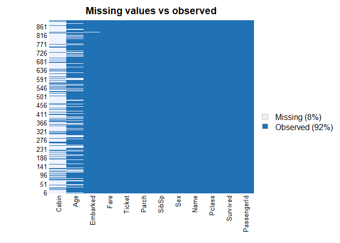
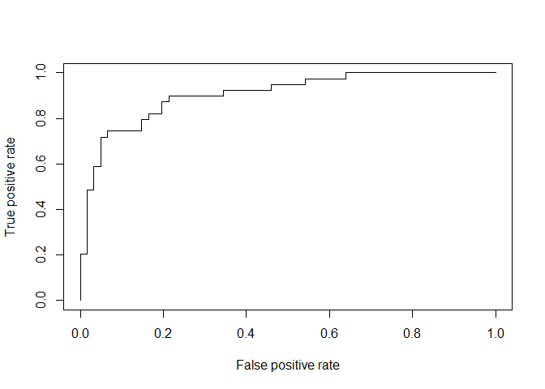
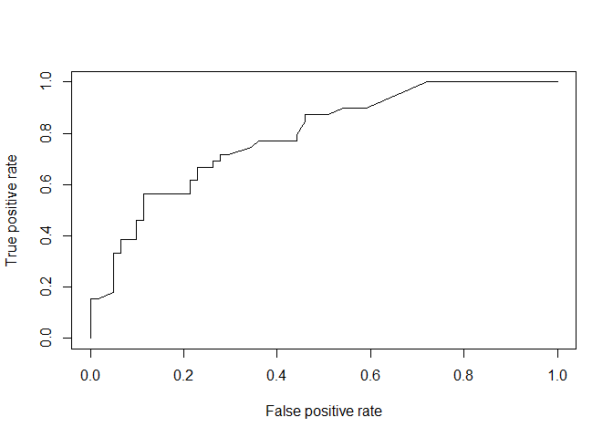
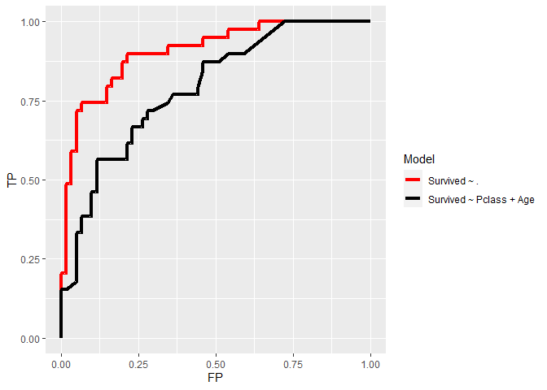

Machine Learning from Titanic Disaster
================
Pouria
3/28/2022

# Objective

This dataset contain the data related to the passengers of the Titanic.
The goal is to see if we are able to build a model that can predict
whether or not a passenger would survive. The `Survived` column of this
dataset reflects if they really survived or not (`1`: survived, and `0`:
didn’t survive).

# Import Required Libraries and Tools

``` r
library(caret)
```

    ## Loading required package: ggplot2

    ## Loading required package: lattice

``` r
library(Amelia)
```

    ## Loading required package: Rcpp

    ## ## 
    ## ## Amelia II: Multiple Imputation
    ## ## (Version 1.8.1, built: 2022-11-18)
    ## ## Copyright (C) 2005-2023 James Honaker, Gary King and Matthew Blackwell
    ## ## Refer to http://gking.harvard.edu/amelia/ for more information
    ## ##

``` r
library(dplyr)
```

    ## 
    ## Attaching package: 'dplyr'

    ## The following objects are masked from 'package:stats':
    ## 
    ##     filter, lag

    ## The following objects are masked from 'package:base':
    ## 
    ##     intersect, setdiff, setequal, union

``` r
library(boot)
```

    ## 
    ## Attaching package: 'boot'

    ## The following object is masked from 'package:lattice':
    ## 
    ##     melanoma

``` r
library(ROCR)
library(pscl)
```

    ## Classes and Methods for R developed in the
    ## Political Science Computational Laboratory
    ## Department of Political Science
    ## Stanford University
    ## Simon Jackman
    ## hurdle and zeroinfl functions by Achim Zeileis

# 1. Import/read the data.

Load the attached csv file into your Markdown accounting for the missing
values.

## Import the csv file

Let’s import the training data here:

``` r
training.data.raw <- read.csv('Titanic.csv', na.strings=c(""))
# training.data.raw <- read.csv('Titanic.csv')

head(training.data.raw)
```

    ##   PassengerId Survived Pclass
    ## 1           1        0      3
    ## 2           2        1      1
    ## 3           3        1      3
    ## 4           4        1      1
    ## 5           5        0      3
    ## 6           6        0      3
    ##                                                  Name    Sex Age SibSp Parch
    ## 1                             Braund, Mr. Owen Harris   male  22     1     0
    ## 2 Cumings, Mrs. John Bradley (Florence Briggs Thayer) female  38     1     0
    ## 3                              Heikkinen, Miss. Laina female  26     0     0
    ## 4        Futrelle, Mrs. Jacques Heath (Lily May Peel) female  35     1     0
    ## 5                            Allen, Mr. William Henry   male  35     0     0
    ## 6                                    Moran, Mr. James   male  NA     0     0
    ##             Ticket    Fare Cabin Embarked
    ## 1        A/5 21171  7.2500  <NA>        S
    ## 2         PC 17599 71.2833   C85        C
    ## 3 STON/O2. 3101282  7.9250  <NA>        S
    ## 4           113803 53.1000  C123        S
    ## 5           373450  8.0500  <NA>        S
    ## 6           330877  8.4583  <NA>        Q

# 2. Preprocess the data.

## Missing values

- Check for the missing values for each variable.

Now we need to check for missing values and look how many unique values
there are for each variable using the `sapply()` function to apply
`is.na()` on to all variables in the data.

``` r
# sapply(data, function(x){})
```

``` r
sapply(training.data.raw,function(x) sum(is.na(x)))
```

    ## PassengerId    Survived      Pclass        Name         Sex         Age 
    ##           0           0           0           0           0         177 
    ##       SibSp       Parch      Ticket        Fare       Cabin    Embarked 
    ##           0           0           0           0         687           2

``` r
sapply(training.data.raw, function(x) length(unique(x)))
```

    ## PassengerId    Survived      Pclass        Name         Sex         Age 
    ##         891           2           3         891           2          89 
    ##       SibSp       Parch      Ticket        Fare       Cabin    Embarked 
    ##           7           7         681         248         148           4

## Leave out irrelevant variables

- Ignore/leave out the variables `PassengerID`, `Cabin`, `Ticket`, and
  `Name`.

``` r
names(training.data.raw)
```

    ##  [1] "PassengerId" "Survived"    "Pclass"      "Name"        "Sex"        
    ##  [6] "Age"         "SibSp"       "Parch"       "Ticket"      "Fare"       
    ## [11] "Cabin"       "Embarked"

``` r
# data <- subset(training.data.raw,select=c(2,3,5,6,7,8,10,12))
data <- training.data.raw %>%
  select(-c("PassengerId", "Cabin", "Ticket", "Name"))

head(data)
```

    ##   Survived Pclass    Sex Age SibSp Parch    Fare Embarked
    ## 1        0      3   male  22     1     0  7.2500        S
    ## 2        1      1 female  38     1     0 71.2833        C
    ## 3        1      3 female  26     0     0  7.9250        S
    ## 4        1      1 female  35     1     0 53.1000        S
    ## 5        0      3   male  35     0     0  8.0500        S
    ## 6        0      3   male  NA     0     0  8.4583        Q

## Visualize missing values

- Use `missmap()` to visualize the missing values.

We can also visualize the missing values using the function `missmap()`.

``` r
missmap(training.data.raw, main = "Missing values vs observed") 
```

<!-- -->

## Impute the missing values

- Only keep those rows that are not `NA` in `Embarked`

- Then, impute the missing values in `Age` with mean value.

``` r
data <- data[!is.na(data$Embarked),]

data$Age[is.na(data$Age)] <- mean(data$Age,na.rm=T)

head(data)
```

    ##   Survived Pclass    Sex      Age SibSp Parch    Fare Embarked
    ## 1        0      3   male 22.00000     1     0  7.2500        S
    ## 2        1      1 female 38.00000     1     0 71.2833        C
    ## 3        1      3 female 26.00000     0     0  7.9250        S
    ## 4        1      1 female 35.00000     1     0 53.1000        S
    ## 5        0      3   male 35.00000     0     0  8.0500        S
    ## 6        0      3   male 29.64209     0     0  8.4583        Q

# 3. Split the data

Split the data up into the training and test set. (`set.seed = 1`).

## Split the data

- Sample 100 rows from the data and use as your test set. Use the rest
  as your training set.

``` r
set.seed(1)
test.ID <- sample(dim(data)[1], 100)
train <- data[-test.ID,]
test <- data[test.ID,]
```

# 4. Logistic Regression

Fit a logistic regression model onto the training set

## Fit and summarize

- Fit and summarize the model to predict `Survived` as a function of all
  other remaining variables.

``` r
model <- glm(Survived ~ ., family=binomial(link="logit"), data = train)
summary(model)
```

    ## 
    ## Call:
    ## glm(formula = Survived ~ ., family = binomial(link = "logit"), 
    ##     data = train)
    ## 
    ## Coefficients:
    ##              Estimate Std. Error z value Pr(>|z|)    
    ## (Intercept)  5.246098   0.601126   8.727  < 2e-16 ***
    ## Pclass      -1.047623   0.152370  -6.876 6.18e-12 ***
    ## Sexmale     -2.717508   0.212350 -12.797  < 2e-16 ***
    ## Age         -0.041380   0.008403  -4.925 8.45e-07 ***
    ## SibSp       -0.298049   0.110674  -2.693  0.00708 ** 
    ## Parch       -0.125844   0.124312  -1.012  0.31138    
    ## Fare         0.001772   0.002772   0.639  0.52263    
    ## EmbarkedQ   -0.146313   0.403005  -0.363  0.71656    
    ## EmbarkedS   -0.428994   0.247267  -1.735  0.08275 .  
    ## ---
    ## Signif. codes:  0 '***' 0.001 '**' 0.01 '*' 0.05 '.' 0.1 ' ' 1
    ## 
    ## (Dispersion parameter for binomial family taken to be 1)
    ## 
    ##     Null deviance: 1049.04  on 788  degrees of freedom
    ## Residual deviance:  706.49  on 780  degrees of freedom
    ## AIC: 724.49
    ## 
    ## Number of Fisher Scoring iterations: 5

## Use `anova()`

- Use `anova()` to see the effect of each variable on the residual
  deviance.

``` r
anova(model, test="Chisq")
```

    ## Analysis of Deviance Table
    ## 
    ## Model: binomial, link: logit
    ## 
    ## Response: Survived
    ## 
    ## Terms added sequentially (first to last)
    ## 
    ## 
    ##          Df Deviance Resid. Df Resid. Dev  Pr(>Chi)    
    ## NULL                       788    1049.04              
    ## Pclass    1   82.196       787     966.85 < 2.2e-16 ***
    ## Sex       1  221.992       786     744.85 < 2.2e-16 ***
    ## Age       1   20.725       785     724.13 5.302e-06 ***
    ## SibSp     1   12.431       784     711.70 0.0004223 ***
    ## Parch     1    0.857       783     710.84 0.3544538    
    ## Fare      1    0.974       782     709.87 0.3236963    
    ## Embarked  2    3.376       780     706.49 0.1848942    
    ## ---
    ## Signif. codes:  0 '***' 0.001 '**' 0.01 '*' 0.05 '.' 0.1 ' ' 1

## Pseudo-R2

- Obtain pseudo-R2 of the model, e.g., McFadden R2.

``` r
pR2(model)
```

    ## fitting null model for pseudo-r2

    ##          llh      llhNull           G2     McFadden         r2ML         r2CU 
    ## -353.2453603 -524.5205194  342.5503183    0.3265366    0.3521898    0.4789011

# 5. Evaluate your model on the test set.

## Misclassification error

- Use your model on the test set to make predictions of `Survived`.

- Calculate the misclassification error on your test set with threshold
  = `0.5`.

``` r
pred.results <- predict(model, newdata=subset(test, select=-1), type = "response")

pred.results <- ifelse(pred.results > .5, 1, 0)


misClassificationError <- mean(pred.results!= test$Survived)
print(paste("Accuracy = ", 1-misClassificationError))
```

    ## [1] "Accuracy =  0.83"

## Confusion Matrix

- Compute the confusion matrix for the model with the test set.

You may use either `table()` or `confusionMatrix()` to obtain the
confusion matrix.

``` r
confusionMatrix(factor(test$Survived), factor(pred.results))
```

    ## Confusion Matrix and Statistics
    ## 
    ##           Reference
    ## Prediction  0  1
    ##          0 52  9
    ##          1  8 31
    ##                                           
    ##                Accuracy : 0.83            
    ##                  95% CI : (0.7418, 0.8977)
    ##     No Information Rate : 0.6             
    ##     P-Value [Acc > NIR] : 6.256e-07       
    ##                                           
    ##                   Kappa : 0.6444          
    ##                                           
    ##  Mcnemar's Test P-Value : 1               
    ##                                           
    ##             Sensitivity : 0.8667          
    ##             Specificity : 0.7750          
    ##          Pos Pred Value : 0.8525          
    ##          Neg Pred Value : 0.7949          
    ##              Prevalence : 0.6000          
    ##          Detection Rate : 0.5200          
    ##    Detection Prevalence : 0.6100          
    ##       Balanced Accuracy : 0.8208          
    ##                                           
    ##        'Positive' Class : 0               
    ## 

``` r
# table(test$Survived, pred.results)
```

## Plot ROC

- Use library **ROCR** to plot ROC curve.

Use `prediction()` and then pass its output to `performance()` to obtain
the true positive rate (`"tpr"`) and false positive rate (`"fpr"`)
values for different thresholds. Notice that you will not have to worry
about setting thresholds. `performance()` will automatically try
different thresholds and accordingly return the rate values in two
arrays that are accessible by `@` (instead of `$`).

``` r
pred <- predict(model, newdata=subset(test, select=-1), type = "response")
pr <- prediction(pred, test$Survived)
prf <- performance(pr, measure = "tpr", x.measure = "fpr")
plot(prf)
```

<!-- -->

## Obtain AUC

- Your measure in `performance()` will be `"auc"` this time.

``` r
auc <- performance(pr, measure = "auc")
auc <- auc@y.values[[1]]
auc
```

    ## [1] 0.9058428

## Calculate the accuracy using CV error

- the accuracy result your obtained depends on the test set – so, now
  re-estimate the accuracy with a 10-fold CV

``` r
model.full <- glm(Survived ~ ., family=binomial(link="logit"), data = data)
cv.error <- cv.glm(data, model.full, K=10)$delta[1]
accuracy <- 1 - cv.error
accuracy
```

    ## [1] 0.8566667

# 6. Fit a new model

- Redo the last two steps with only `Pclass` and `Age`.

## Implement a new fit with `Pclass` and `Age`

Do the fit again with only `Pclass` and `Age`;

``` r
model2 <- glm(Survived ~ Pclass + Age, family=binomial(link="logit"), data = train)
summary(model2)
```

    ## 
    ## Call:
    ## glm(formula = Survived ~ Pclass + Age, family = binomial(link = "logit"), 
    ##     data = train)
    ## 
    ## Coefficients:
    ##             Estimate Std. Error z value Pr(>|z|)    
    ## (Intercept)  2.92568    0.37483   7.805 5.94e-15 ***
    ## Pclass      -1.03179    0.10490  -9.836  < 2e-16 ***
    ## Age         -0.03666    0.00678  -5.408 6.38e-08 ***
    ## ---
    ## Signif. codes:  0 '***' 0.001 '**' 0.01 '*' 0.05 '.' 0.1 ' ' 1
    ## 
    ## (Dispersion parameter for binomial family taken to be 1)
    ## 
    ##     Null deviance: 1049.04  on 788  degrees of freedom
    ## Residual deviance:  935.76  on 786  degrees of freedom
    ## AIC: 941.76
    ## 
    ## Number of Fisher Scoring iterations: 4

## Anova

``` r
anova(model, model2)
```

    ## Analysis of Deviance Table
    ## 
    ## Model 1: Survived ~ Pclass + Sex + Age + SibSp + Parch + Fare + Embarked
    ## Model 2: Survived ~ Pclass + Age
    ##   Resid. Df Resid. Dev Df Deviance
    ## 1       780     706.49            
    ## 2       786     935.76 -6  -229.27

## Estimate the accuracy with 10-fold CV.

``` r
model2.cv <- glm(Survived ~ Pclass + Age, family=binomial(link="logit"), data = data)
cv.error2 <- cv.glm(data, model2.cv, K=10)$delta[1]
accuracy <- 1 - cv.error2
accuracy
```

    ## [1] 0.7985145

## Misclassification on test set

- Make predictions on the test set and calculate misclassification

``` r
pred.results2 <- predict(model2, newdata=subset(test, select=-1))
pred.results2 <- ifelse(pred.results > .5, 1, 0)

misClassificationError <- mean(pred.results!= test$Survived)
print(paste("Accuracy = ", 1-misClassificationError))
```

    ## [1] "Accuracy =  0.83"

## Confusion Matrix

``` r
confusionMatrix(factor(test$Survived), factor(pred.results2))
```

    ## Confusion Matrix and Statistics
    ## 
    ##           Reference
    ## Prediction  0  1
    ##          0 52  9
    ##          1  8 31
    ##                                           
    ##                Accuracy : 0.83            
    ##                  95% CI : (0.7418, 0.8977)
    ##     No Information Rate : 0.6             
    ##     P-Value [Acc > NIR] : 6.256e-07       
    ##                                           
    ##                   Kappa : 0.6444          
    ##                                           
    ##  Mcnemar's Test P-Value : 1               
    ##                                           
    ##             Sensitivity : 0.8667          
    ##             Specificity : 0.7750          
    ##          Pos Pred Value : 0.8525          
    ##          Neg Pred Value : 0.7949          
    ##              Prevalence : 0.6000          
    ##          Detection Rate : 0.5200          
    ##    Detection Prevalence : 0.6100          
    ##       Balanced Accuracy : 0.8208          
    ##                                           
    ##        'Positive' Class : 0               
    ## 

## ROC Curve

Plot ROC for this new model on top of the ROC curve for the full model -
what do you conclude?

``` r
pred2 <- predict(model2, newdata=subset(test, select=-1), type = "response")
pr2 <- prediction(pred2, test$Survived)
prf2 <- performance(pr2, measure = "tpr", x.measure = "fpr")
plot(prf2)
```

<!-- -->

``` r
auc2 <- performance(pr2, measure = "auc")
auc2 <- auc2@y.values[[1]]
auc2
```

    ## [1] 0.7881463

## Both ROC Curves

``` r
df1 <- data.frame(prf@y.values, prf@x.values) %>%
  mutate(Model = "Survived ~ .") %>%
  `colnames<-`(c("TP", "FP", "Model"))

df2 <- data.frame(prf2@y.values, prf2@x.values) %>%
  mutate("Model" = "Survived ~ Pclass + Age") %>%
  `colnames<-`(c("TP", "FP", "Model"))

df <- rbind(df1, df2)
```

``` r
ggplot(df) +
  geom_line(aes(x = FP, y = TP, col = Model), linewidth = 1.5) +
  scale_color_manual(values = c("red", "black")) 
```

<!-- -->
